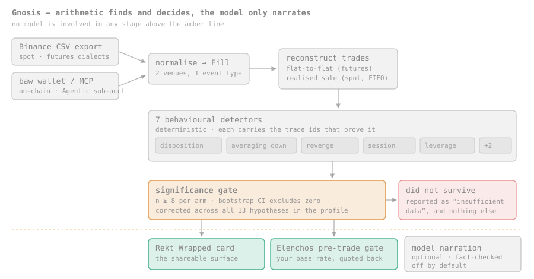
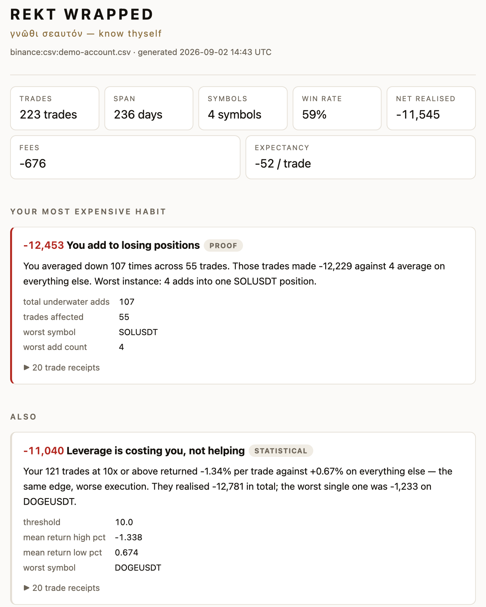
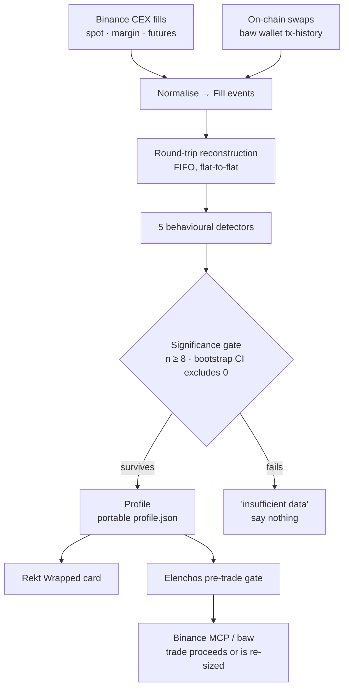

# Gnosis

**γνῶσις** — *knowledge*; specifically, knowledge arrived at by looking rather
than by being told. From the same root as **γνῶθι σεαυτόν**, *know thyself*, the
maxim carved at Delphi.

**A trading agent that reads your own history back to you before it lets you
repeat it.**

Built for the Binance Agent OS Mini Hackathon — Track A.

### ▶ [Watch the demo](https://youtu.be/uoZdfchqyek)

It opens on a trader with *no* planted problem, where the tool looks and says
nothing — that beat is the claim. Then a book with habits planted in it, and
both directions of the pre-trade gate.



---

## Try it in three commands

No install. No dependencies. No API keys. No network. Nothing leaves your machine.

```bash
git clone https://github.com/geralexgr/gnosis && cd gnosis

./gnosis card  corpus/demo-account.csv      # what your habits cost you
./gnosis check corpus/demo-account.csv --symbol DOGEUSDT --notional 7000 \
    --leverage 25 --at 2026-09-01T03:14 --since-loss 41
```

`corpus/demo-account.csv` is a **fictional** futures book, committed so this runs
from a clone. Point the same commands at your own Binance CSV export instead —
see [Using your own data](#using-your-own-data).

### What you get

```

  REKT WRAPPED  · γνῶθι σεαυτόν ·
━━━━━━━━━━━━━━━━━━━━━━━━━━━━━━━━━━━━━━━━━━━━━━━━━━━━━━━━━━━━━━━━━━━━

  242 trades · 236 days · 4 symbols · 60% win rate
  net -11,577   fees -676   expectancy -48/trade

────────────────────────────────────────────────────────────────────
  YOUR MOST EXPENSIVE HABIT

  You sell winners early and nurse losers
  You hold losers 4.9x longer than winners (median 11.5h vs 2.3h).
  Your 98 losing trades realised -17,986.

────────────────────────────────────────────────────────────────────
  ALSO

  -12,702  You add to losing positions
    You averaged down 91 times across 47 trades. Those trades made
    -12,484 against 5 average on everything else. Worst instance: 4
    adds into one SOLUSDT position.

  -10,633  Leverage is costing you, not helping
    Your 118 trades at 10x or above returned -1.48% per trade
    against +0.67% on everything else — the same edge, worse
    execution. They realised -13,082 in total; the worst single one
    was -1,233 on DOGEUSDT.

  -8,998  You lose money in the small hours
    Your 55 trades in the small hours (00:00-06:00 UTC) averaged
    -174 against -11 the rest of the day, for a total of -9,584.

  -8,806  DOGEUSDT is where your profits go
    Your 48 DOGEUSDT trades returned -3.44% each against +0.37%
    across your other 194 trades, and realised -10,221 against
    -11,577 for the book as a whole. Tested against all 4 symbols
    you trade often enough to judge, not picked after the fact.

────────────────────────────────────────────────────────────────────
  WHAT YOU ACTUALLY DO WELL

  You are good in the London session
    Your 46 trades in the London session (12:00-16:00 UTC) averaged
    3 against -60 elsewhere.

────────────────────────────────────────────────────────────────────
  THE UNIVERSES WHERE YOU ARE RICHER

    +13,082  if you had never traded above 10x
    +12,484  if you had never added to a losing position
     +9,584  if you had never traded the small hours (00:00-06:00 UTC)

  Removes those trades and re-totals. Assumes the rest
  are unchanged, which is an assumption, not a fact.

━━━━━━━━━━━━━━━━━━━━━━━━━━━━━━━━━━━━━━━━━━━━━━━━━━━━━━━━━━━━━━━━━━━━
  every number above is computed, not generated · 100 trade receipts
```

### And before you place a trade

The same engine, asked about a trade you are *about to* make. 03:14 UTC, 25x,
41 minutes after booking a loss:

```

  ✗ SKIP  This matches your most expensive pattern — buying DOGEUSDT. 28 prior trades, 18% win rate, -246 each.

    · the small hours (00:00-06:00 UTC): 55 trades, 18% win rate, -174 per trade against your -48 baseline
    · at 10x or above: 118 trades, 42% win rate, -111 per trade against your -48 baseline
    · buying DOGEUSDT: 28 trades, 18% win rate, -246 per trade against your -48 baseline

    Your record suggests 1,322, not 7,000.
    Elenchos never blocks. This is your own history, quoted back.
```

Now the same book, a different trade — daytime, on the symbol this trader is
actually good at, sized small:

```

  ✓ FAVOURABLE  This matches one of your better patterns — buying BTCUSDT. 41 prior trades, 83% win rate, +18 each.

    · the London session (12:00-16:00 UTC): 46 trades, 74% win rate, +3 per trade against your -48 baseline
    · buying BTCUSDT: 41 trades, 83% win rate, +18 per trade against your -48 baseline

    Your record suggests 2,645, not 900.
    Elenchos never blocks. This is your own history, quoted back.
```

That second one is the half most risk tools never do: **it tells you to size
up.** A gate that only ever says no gets switched off, and then it protects
nobody. Elenchos never blocks — it quotes your base rate and gets out of the way.

### A shareable report, too

The same profile renders to a **single self-contained HTML file** — no external
CSS, fonts, scripts or images, so it opens offline and survives being emailed:

```bash
python3 scripts/make_report.py corpus/demo-account.csv --out report.html
python3 scripts/make_report.py my-export.csv --redact --out report.html   # no currency amounts
```



Charts are hand-rolled inline SVG rather than a charting library, for the same
reason there are no dependencies anywhere else: it has to work from a clone,
offline, forever.

### Reading the output

| Term | Means |
|---|---|
| **leak** | A behavioural pattern that costs you money, which survived a significance test |
| **receipts** | The trade ids behind every number, so you can check rather than believe |
| **counterfactual** | What one rule, applied consistently, would have been worth. A description of the past, not a forecast |
| **within noise** | A base rate that exists but does not differ from your baseline enough to act on |
| `✗ SKIP` | Your own record says this pattern loses money |
| `! CAUTION` | Below your baseline, but still profitable |
| `· PROCEED` | Nothing in your record argues against it |
| `✓ FAVOURABLE` | This matches one of your better patterns |

Amounts are in the **quote currency of each pair** — USDT for `BTCUSDT`. Gnosis
never converts between quotes, and warns when a book mixes them.

### Is it safe?

Short answer: yes, and it is easy to verify because there is so little to it.

- **It never places a trade.** There is no order-placing code in this repository.
- **It needs no API keys and no exchange permissions.** It reads a CSV you
  downloaded.
- **Your history never leaves your machine.** No network calls, no telemetry.
- The two exceptions are opt-in and off by default: `--narrate` sends *computed
  facts* (leak titles, totals, sample sizes) to Anthropic's API — never your
  fills; and `scripts/publish_card.py` posts to Binance Square, which is dry-run
  and redacted unless you pass `--yes`.

---

## Use it from an agent

Binance shipped an MCP server so an agent can place orders. **Nothing in that
loop knows what this trader has historically done in this exact situation.**

Gnosis is an MCP server too. Point your client at both, and the agent can ask
before it acts — same conversation, same client, two servers:

```bash
claude mcp add binance-mcp-server --transport http https://agent.binance.com/mcp/agentic
claude mcp add gnosis -- /absolute/path/to/gnosis/scripts/gnosis-mcp
```

Or, for any MCP client that reads a JSON config:

```json
{
  "mcpServers": {
    "gnosis": { "command": "/absolute/path/to/gnosis/scripts/gnosis-mcp" }
  }
}
```

Four tools, **all read-only** — they place no orders and move no funds:

| Tool | Use |
|---|---|
| `gnosis_check` | Before executing a trade — including one you were about to place with a Binance MCP tool — get this trader's own base rate for trades like it |
| `gnosis_profile` | The full behavioural profile as JSON |
| `gnosis_card` | The rendered Rekt Wrapped card |
| `gnosis_explain` | What a given leak means and how it is detected |

The point is composition. An agent with Binance's MCP alone can execute a plan.
An agent with both can be asked *"check this against my history first"* and get
an answer grounded in the user's own fills rather than in the model's opinion
about markets — which it does not have.

It also ships as a [`SKILL.md`](SKILL.md) for the Binance Skills Hub, with
trigger phrases and intent→command routing, so an agent that reads skills rather
than speaking MCP can use it too.

---

## Using your own data

**Get the export.** Binance → Orders → Trade History → *Export*. Spot and
Futures are separate exports and Gnosis reads both layouts:

| Product | Expected header |
|---|---|
| Spot | `Time, Pair, Side, Price, Executed, Amount, Fee` |
| Futures | `Date(UTC), Symbol, Side, Price, Quantity, Amount, Fee, Realized Profit, Leverage, Margin Mode` |

```bash
./gnosis card my-export.csv
```

**Expect a spot account to be declined.** This is the most likely first result
and it is not a bug. Gnosis needs 30 closed positions and spot investors
accumulate and hold — a real spot export spanning years produced fewer than thirty
realised trades and was refused. **Futures and margin books close properly and profile
well.**

Two other things Gnosis does to your data before measuring it, both deliberate:
stablecoin conversions (USDT↔USDC) are dropped because they are not decisions,
and trades under 1 unit of notional are dropped as exchange residue.

### If it will not parse

```bash
python3 scripts/inspect_csv.py my-export.csv
```

It reports encoding, BOM, delimiter, the header it found, which dialect matched
(and for an unrecognised header, the near-misses), then every failing row with
its line number and the offending value. It cannot itself crash and always exits
0, so the output is safe to paste into an issue — account-shaped columns are
redacted.

Known limits worth checking there first: fees paid in **BNB** cannot be valued
from the file alone and the parse will refuse until you supply a price;
`.xlsx` exports must be saved as CSV first.

---

## The problem

Every serious trader loses money the same way twice. Not to the market — to a
habit they cannot see from the inside, because the evidence for it is scattered
across six months of fills and nobody reconstructs six months of fills.

The behaviours are well documented and individually boring:

- **The disposition effect.** Selling winners in hours and holding losers for
  weeks. Named by Shefrin and Statman in 1985 and replicated on brokerage data
  ever since.
- **Averaging down.** The third add into a losing position is where the damage
  reliably lives.
- **Revenge sizing.** The trade placed forty minutes after booking a loss, at
  twice the usual size.

Everyone knows these exist. Almost nobody knows *which one is theirs*, *how much
it costs*, or *that they are about to do it again right now.* That is a data
problem, and it is solvable.

## What Gnosis does

Two surfaces over one engine.

**Rekt Wrapped** — the shareable card. Reads your history, finds the specific
behavioural leak costing you money, quantifies it, and says so bluntly.

**Elenchos** — the pre-trade gate. Named for the Socratic ἔλεγχος, the method of
refuting someone using only their own prior statements. Before a trade is
placed, it looks up what you have historically done in situations like this one
and quotes the base rate.

```
PROPOSED  ETH long · 20x · $4,000 · 03:14 UTC
          41 min after a −$800 realised loss

YOUR RECORD ON TRADES LIKE THIS
  the small hours (00:00–06:00 UTC)   65 trades · 23% win rate · −37 each
  at 10x or above                     76 trades · 49% win rate · −7 each
  your baseline                                                  −12 each

VERDICT  ✗ SKIP — this matches your most expensive pattern
          your record suggests $643, not $4,000
```

It is the same argument a risk-limit config makes, except it is not an opinion.
It is the trader's own receipts, quoted back at the one moment they matter.

## How it works

The central design decision, borrowed from a system that had to survive the same
credibility problem: **arithmetic finds the leaks, and the model only narrates
the survivors.**

```
fills → [1] normalise both venues to one event type      no model involved
      → [2] reconstruct flat-to-flat round-trips         no model involved
      → [3] five behavioural detectors                   no model involved
      → [4] significance gate: n ≥ 8, bootstrap CI       no model involved
      → [5] counterfactuals, licensed by a proven leak   no model involved
      → [6] narration + the marginal pre-trade call      model
```



Why this ordering matters: **a model asked to find problems in a trade history
will always find some**, because that is what it was asked to do. Sycophancy and
pattern-matching both push the same way, and the output is indistinguishable
from astrology. Moving the *decision* into arithmetic means the model never gets
to invent a leak — it only ever explains one that already survived a confidence
interval.

**The gate is held to the same bar as the detectors.** This was not true at
first and the consequence was instructive: the detectors were bootstrap-gated
and family-corrected while Elenchos compared raw means and required only a
minimum sample. Measured against *clean* synthetic traders with no planted leak,
that gate returned a strong verdict on **19 of 24** neutral proposals. The
astrology had simply moved downstream. Analogues now carry the same significance
test, and only significant ones may drive a verdict; the rest are shown as
context marked *(within noise)*. Re-measured over 120 neutral proposals against
15 clean traders: **0% skip, 0% caution**, 95% proceed, 5% favourable — while
still returning `skip` for the night-leak trader at 03:00 and the
over-leveraged trader at 20x, and `proceed` for that same night-leak trader at
14:00.

### The three rules that keep it honest

1. **Minimum sample.** Below 8 observations per arm, Gnosis reports *insufficient
   data* and says nothing else. Being willing to say nothing is what earns the
   right to be believed on everything else.
2. **The interval must exclude zero.** Every claim rests on a bootstrap CI on the
   difference, not on a gap that merely looks large.
3. **Compare the trader to themselves.** Every split is measured against that
   trader's own baseline on the complement of the slice — never a market
   average, never another user.

### Counterfactuals are gated behind a proven leak

The alternate-universe numbers are the most persuasive output and the easiest to
abuse. Slice any history four ways and one slice always looks worth removing.

So a counterfactual only surfaces if a detector already proved a significant leak
**in that specific dimension** — and the licence matches the *slice*, not the
family: proving 00:00–06:00 is bad does not license a claim about 06:00–12:00.

On a clean synthetic trader the raw counterfactuals offer five tempting numbers
up to +$920. The profile suppresses all five, because no detector proved
anything. That suppression is the feature.

## Measured, not claimed

Every trader in the corpus is generated **twice** — once with an injected
behavioural leak, once without, from the same decision list. The pair differs
*only* in the planted pathology, so anything reported on the twin is
unambiguously noise.

```bash
python3 evals/score.py --traders 40 --nulls 150   # ~10 min, both numbers below
```

280 defective traders + 280 clean twins across seven leak types, plus 150
independent null traders:

| | |
|---|---|
| recall (the *correct* detector fired) | **83.6%** |
| false positives across 280 clean twins | **2.50%** (7/280) |
| family-wise error on 150 *independent* null traders | **4.00%** (6/150) |
| bootstrap null rate, measured | 12.5% against a nominal 10% |

Recall is scored *specifically*: a run only counts if the detector assigned to
the planted leak fired. A noisy detector that fires on everything scores zero.

Broken out by effect size, because a single recall figure hides whether a
detector only works on caricatures:

| injected strength | recall |
|---|---|
| subtle (0.6–0.9×) | 69.4% |
| clear (0.9–1.2×) | 86.8% |
| severe (1.2–1.5×) | 95.6% |

**Two false-positive numbers, and the larger one is the honest one.** The 2.50%
is measured on clean twins — each the structural partner of a defective trader.
The 4.00% is measured on 150 *independent* traders generated from unrelated
seeds with nothing injected, which is the family-wise error rate of the whole
profile and the number to quote if you only quote one. They should agree and
they do not quite; the gap is sampling, and it is the same lesson as before —
a false-positive rate measured on a small or structurally-related sample reads
better than the truth. Bonferroni's intent here is a family-wise rate at or
below 10%, so 4.00% is the correction behaving conservatively, as designed.

Per detector, so a weak one cannot hide behind the average:

| leak | recall |
|---|---|
| `disposition_effect` | 100% |
| `averaging_down` | 100% |
| `symbol_selection` | 95.0% |
| `leverage_drag` | 87.5% |
| `session_performance` | 80.0% |

`revenge_trading` fell from 72.5% when its comparison was changed from dollars
to percentage return. That was not a regression: selecting a slice on trade
*size* and then comparing it on *dollar* PnL is confounded before any behaviour
is measured, and on null traders with no post-loss behaviour at all the dollar
version called 61% of them negative. Twelve points of recall was the price of an
unbiased estimator, and it was worth paying.
| `revenge_trading` | 60.0% |
| `stop_migration` | 62.5% |

`stop_migration` is the weak one and is reported as such rather than tuned until
it looks better. At low injected strength the widened-stop arm is ~32 trades
against a ~74-trade control with under a percentage point of return between
them, which is near the resolution limit of a family-13 correction. It is silent
rather than wrong: zero fires across all 280 twins.

### What these numbers cost to get right

The false-positive rate is the headline, not recall. A profiler that invents
leaks is worse than no profiler, because the user cannot tell which findings to
trust and correctly discounts all of them.

Getting it honest took three corrections worth stating plainly, because each is
a trap the next person will hit:

**Small corpora lie about false positives — twice.** At 100 twins the rate read
0.00%. At 200 twins the same code measured 7.5%. Nothing had regressed; there
were simply not enough twins to see it. After fixing the causes below, 75 twins
again read 0.00% and 200 twins read 5.00%. Any false-positive figure quoted on a
small corpus should be assumed to be an underestimate, including one you
measured yourself an hour ago.

**Correct across the profile, not within a detector.** A profile tests eight
hypotheses — four pre-registered sessions plus disposition, averaging-down,
revenge and leverage. Originally only the session detector corrected for
multiple comparisons, and the other four each tested at a raw 90% interval whose
measured null rate is 12.5%. Correcting family-wide (`PROFILE_FAMILY = 8`) is
what took the rate down; it costs about six points of recall on subtle effects,
and the trade is measurable:

| correction | recall | false positives (75 twins) |
|---|---|---|
| none | 96.0% | 13.33% |
| **family-wide** | **89.3%** | **0.00%** |

Adding two detectors later raised the family from 8 to 13, which cost the
original five about 2.6 points of recall and took the false-positive rate from
5.00% to 2.50%. Every hypothesis you add is paid for by every other one.

Set `GNOSIS_FAMILY=1` to see the other side of that trade yourself.

**A contract that is documented but not enforced is not a contract.**
`detectors/base.py` states that a `weak` finding "never surfaces to a user on
its own" — and then one detector returned a weak finding unconditionally and the
card rendered every leak handed to it. The guarantee is now enforced in one
place, in `Profile`, where `leaks` holds only surfacing findings and `watch`
holds the underpowered ones. The eval was also scoring the raw detectors rather
than the real `Profile`, so it had been measuring findings no user would ever
see.

The residual 5% sits close to the nominal family-wise rate for this correction,
so it is expected statistical behaviour rather than a remaining bug. In practice
it means roughly one clean trader in twenty sees a single spurious finding —
which is why **every finding carries the trade ids that produced it**, so it can
be checked rather than believed.

### What a real export changed

The corpus is synthetic, and synthetic data agrees with whatever model produced
it. The first real Binance spot export — several hundred fills over a couple of
years — broke three things that 42 passing round-trip tests had not:

**Dust makes spot positions immortal.** Binance often charges the fee in the
*base* asset, so buying 100 units and paying 0.1 units in fees leaves 99.9 to
sell. "Sell everything" always leaves a residue. Requiring exactly flat to close
a trade meant **most of that trader's positions never closed**, nearly all of
them residues of well under one percent. There is now a dust sweep at 1% of the quantity
opened, and the abandoned quantity is recorded on the trip rather than dropped.

**Flat-to-flat is a futures concept.** A spot investor never goes flat; they
accumulate for years and sell parts. The same export yielded 18 flat-to-flat
trips — below the threshold at which Gnosis will say anything — and 297 sales,
each one a decision with an entry, a holding period and a realised result. There
is now a **realised-sale model**, FIFO-matched, the convention tax authorities
use and for the same reason: it is the only way to assign a holding period to
part of a position. It emits `RoundTrip` too, so every detector works unchanged
on either model, and `Profile` picks by whether the book is leveraged.

**Stablecoin conversions are not trades.** The large majority of realised sales
in that export were stablecoin-to-stablecoin swaps, at a median absolute return
near **0.05%**. Left in, they would have set the baseline expectancy that every
behavioural finding is measured against. Conversions are now excluded before anything is computed.

Ten further defects surfaced in the CSV parser under hostile input — truncated
rows silently booking fee-free fills, `1e400` becoming `inf` and poisoning every
average, scientific notation rejected outright (which would have refused every
SHIB-class fill), UTF-16 exports unreadable. All fixed and pinned by
`tests/test_robustness.py`.

**And the fictional futures account found a fourth defect within minutes of
existing.** `corpus/demo-account.csv` is generated, not real — a spot investor's
export does not contain thirty closed positions, so a demo needs a book that
closes. Parsing it exercised the futures dialect for the first time (649/649
rows) and immediately surfaced *phantom trips*: float residue of `3.6e-12` DOGE
surviving an absolute `1e-12` epsilon, opening a position that closed carrying a
real fee — a $1.24 loss on a notional of `6e-13`, or **−200 trillion percent**.
One of those in an average makes a percentage-based detector meaningless, and it
was silently suppressing a genuine `leverage_drag` finding. An absolute epsilon
cannot work across assets whose quantities differ by fifteen orders of
magnitude; it is now relative to position size, with an economic floor at
`MIN_TRADE_NOTIONAL` — Binance's own minimum notional is around 5 USDT, so a
$0.0001 "trade" is residue, not a decision.

And then, on the real export, Gnosis declined to profile at all: fewer than thirty genuine trades
over a multi-year span is below its own bar, so it said so and stopped. That is the
intended behaviour and it is worth more than a card would have been.

### Detectors

| Detector | What it catches |
|---|---|
| `disposition_effect` | Winners held far less time than losers |
| `averaging_down` | Adds into positions already underwater |
| `revenge_trading` | Re-entry within 90 min of a loss, above usual size |
| `session_performance` | A block of hours that reliably loses money |
| `leverage_drag` | High-leverage trades underperforming your own low-leverage ones |
| `stop_migration` | A protective stop cancelled and re-placed further away while underwater |
| `symbol_selection` | A symbol you keep trading and keep losing money in |

Findings declare how much their evidence is worth — `proof` (the behaviour is
directly countable and not open to interpretation), `statistical` (a slice
differs from baseline and the interval excludes zero), or `weak` (present but
underpowered; never surfaces alone).

## Every command

```bash
./gnosis card    <source>            # the Rekt Wrapped card
./gnosis profile <source>            # machine-readable profile.json
./gnosis check   <source> [...]      # cross-examine a proposed trade

# <source> is any of:
#   my-export.csv            a Binance CSV export, spot or futures
#   corpus/demo-account.csv  the committed fictional demo book
#   baw                      the on-chain wallet (needs `baw`, signed in)
#   synthetic:night[:42]     a labelled fixture with a known planted leak
#                            (disposition · martingale · revenge · night
#                             overleverage · stop_migration · symbol_leak)
```

Optionally, let a model phrase the output. Off by default so the demo and the
tests stay deterministic — and because a card whose wording changes between runs
is a card whose numbers people stop trusting. Only computed facts are sent, and
any number the model writes that Gnosis did not compute throws the narration
away and falls back to the template, naming the number it rejected:

```bash
ANTHROPIC_API_KEY=... ./gnosis card corpus/demo-account.csv --narrate
```

### Seeing it work

The [recorded demo](https://youtu.be/uoZdfchqyek) is this script running:

```bash
./scripts/demo.sh                 # the whole demo, five beats     (~1 min)
./scripts/demo.sh --video         # paced for recording, small corpus (~45 s)
./scripts/demo.sh --slow          # same, paced for screen recording
python3 scripts/inspect_csv.py my-export.csv   # diagnose a CSV     (instant)
python3 scripts/make_report.py corpus/demo-account.csv --out report.html
```

### Verifying the claims

```bash
python3 evals/score.py --traders 40   # the headline numbers        (~8 min)
./scripts/check.sh                    # every suite + the eval        (~6 min)
```

Both are slow and mostly silent — `check.sh` sits in corpus scoring for several
minutes with no output. That is expected, not a hang.

**The numbers in this README come from `evals/score.py --traders 40`.**
`check.sh` runs a smaller corpus to stay under five minutes, so its recall and
false-positive figures will differ — and its false-positive rate in particular
will read *better*, because small corpora systematically understate it. That is
the single most important caveat in this document and it is explained in
[What these numbers cost to get right](#what-these-numbers-cost-to-get-right).

### Further reading

| | |
|---|---|
| [`docs/architecture.md`](docs/architecture.md) | Data flow, the gate sequence, and the round-trip state machine, as diagrams |
| [`SKILL.md`](SKILL.md) | The agent-facing skill: trigger phrases, intent→command routing, and when *not* to use it |
| [`corpus/README.md`](corpus/README.md) | What the fictional demo account is and why it exists |

## Binance Agent OS integration

| Building block | Use |
|---|---|
| **MCP Server** (`agent.binance.com/mcp/agentic`) | Account scope, read-only, for fills and income history. **Note the limit:** this reads the isolated *Agentic sub-account*, not your main account — and a fresh sub-account has no behavioural history at all. For most users the CSV export is the only adapter that sees their real book. |
| **Agentic Wallet** (`baw`) | `wallet tx-history` and `market-order list` for on-chain round-trips |
| **`query-token-audit`** | Retro-scan every token ever swapped: *"6 of the tokens you bought failed an audit you never ran."* Counted per token, not per swap — a failure is a property of a contract, and counting swaps lets one heavily-traded token dominate. Tokens with no audit data are reported as "no data", never as passing. |
| **`square-post`** | Publishing the card to Binance Square via `scripts/publish_card.py` — **dry run and redacted by default**; `--yes` is the only path to posting, and redaction keeps percentages, ratios and counts while removing currency amounts. The psychology is the shareable part; the balance is not. |
| **Skills Hub** | Gnosis ships as a `SKILL.md` so any agent can gate its own trades |

Two constraints discovered by probing the live endpoints, which shaped the
design and are worth stating plainly:

- The authorization server advertises `grant_types_supported: ["authorization_code"]`
  with **no refresh token**, and `baw` requires a phone confirmation to sign in.
  Nothing built on Agent OS runs unattended for long. Gnosis is therefore
  batch-and-gate, not a daemon.
- There is **no dynamic client registration** (`/register` → 404), but
  `client_id_metadata_document_supported: true`, so third-party clients register
  via CIMD rather than DCR.

## Status

Working today, end to end, offline:

- Two-venue event normalisation; **two** trade models — FIFO flat-to-flat for
  leveraged books, FIFO realised-sale for spot — auto-selected, handling adds,
  scale-outs, position flips, dust, and per-venue/per-symbol isolation
- **Seven detectors**, significance-gated, each carrying the trade ids that
  prove it
- Bootstrap statistics with a measured null rate, corrected across all thirteen
  hypotheses a profile tests
- Licensed counterfactuals; Rekt Wrapped card; Elenchos pre-trade gate, held to
  the same significance bar as the detectors
- Ingest from Binance CSV exports (spot **and** futures dialects, both exercised
  against real and generated files) and the `baw` on-chain wallet — strict, so a
  row that will not parse raises with its line number rather than being dropped
- An agent layer, wired into `--narrate`, where the model never decides: it
  receives already-significance-tested facts and its output is fact-checked
  against them — including sign, so it cannot report a cost as a gain — with a
  deterministic fallback on any violation
- **1,061 assertions across nine suites** — round-trips, statistics calibration,
  ingest, agent layer, detectors, hostile input, integrations, MCP server,
  report/webhooks — plus an end-to-end verification script that re-derives the
  numbers above — which prints the assertion total itself rather than
  trusting this sentence. The safety guarantees are mutation-tested: neutering the
  webhook's `send=True` guard or the publisher's `--yes` guard makes tests fail,
  so those are enforced rather than merely documented.

Not done yet — and named rather than implied:

- **`stop_migration` is the weakest detector at 62.5%** and is published as such
  rather than tuned until it looks better. Near the resolution limit of a
  family-13 correction; silent rather than wrong.
- **The futures dialect has never met a real Binance futures export.** It was
  written against documented column names and is exercised only by a generated
  file in that format. The spot dialect *has* been run against a real
  export. The `baw` and MCP JSON shapes are alias-matched because neither is a
  published schema.
- **The MCP ingest adapter has never run against the live server.** It is tested
  against canned responses only, and it reads the isolated Agentic sub-account,
  which for most users contains no history at all.
- **Entry-chase and on-chain slippage detectors** are designed and unwritten.
- **Recall is measured against a corpus this project generates.** The injected
  leaks are transformations written by the same author as the detectors that
  find them. The false-positive rate — measured on clean twins — is the more
  trustworthy of the two numbers, and neither has been validated against a
  labelled real-world dataset, because none exists.

## Licence

MIT — see [LICENSE](LICENSE).

## Disclosures

- Built during the hackathon submission window, which opened 1 September 2026.
- Developed with AI assistance (Claude Code).
- Gnosis is an informational tool. It is not investment advice, it does not
  predict returns, and its counterfactuals are descriptions of the past rather
  than forecasts.
