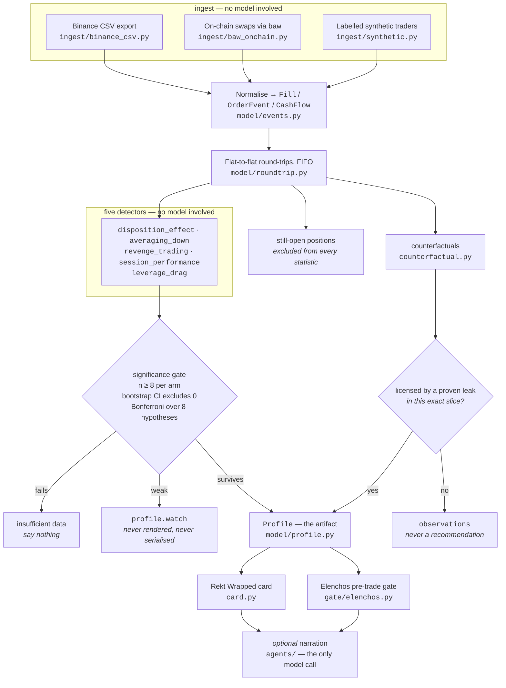
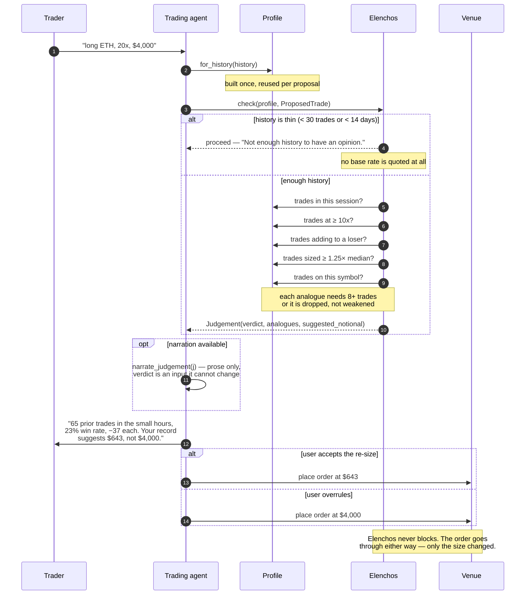
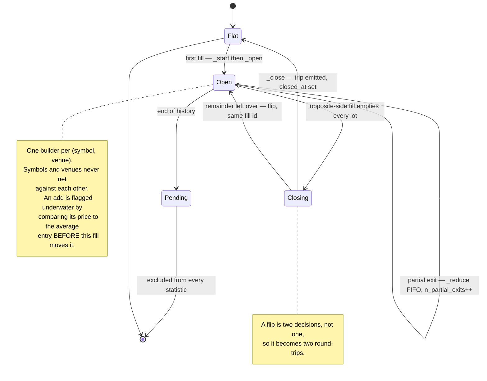

# Architecture

Three diagrams and the reasoning behind them. GitHub renders Mermaid natively, so there
are no image files to fall out of date.

The whole design follows from one sentence: **arithmetic finds the leaks, and the model
only narrates the survivors.** Everything below is a consequence of taking that
seriously.

---

## 1. Data flow

Two venues that agree on almost nothing flatten into one `Fill` type. A swap of USDT for
CAKE is a buy of CAKE and the gas is a fee. The reduction is lossy on purpose: holding
losers, sizing up after a loss and trading at 4am are venue-independent behaviours, and a
detector that had to know which venue it was looking at would be measuring plumbing
rather than a person. Venue-specific facts that still carry signal survive in `Fill.meta`.

The ordering is the whole argument. **A model asked to find problems in a trade history
will always find some**, because that is what it was asked to do. Sycophancy and
pattern-matching push the same way and the output is indistinguishable from astrology.
Putting the *decision* in arithmetic means the model never gets to invent a leak — it
only ever explains one that already cleared a confidence interval.

Three things on this diagram are refusals rather than features, and they are the reason
the false-positive rate on clean twins is 0.00%:

- **The `insufficient data` branch.** Below eight observations in either arm, `assess()`
  returns a `Comparison` whose every other field is meaningless and says so. Being
  willing to say nothing is what earns the right to be believed on everything else.
- **The `watch` branch.** `weak` findings exist and are kept for debugging, but
  `Profile.leaks` holds only findings that surface. This was documented before it was
  enforced, and the gap between those two is where a chunk of a previously-measured 7.5%
  false-positive rate lived.
- **The counterfactual licence.** Slice any history four ways and one slice always looks
  worth removing. A counterfactual only reaches `Profile.counterfactuals` if a detector
  already proved a significant leak in that *specific* slice — proving that 00:00–06:00
  UTC is bad does not license a claim about 06:00–12:00. Everything unlicensed lands in
  `observations` and must never be presented as advice. On a clean synthetic trader the
  raw arithmetic offers five tempting numbers up to +$920 and the profile suppresses all
  five. That suppression is the feature.

Limitations this diagram does not hide. `still-open positions` really are dropped: an
unrealised loss is not yet a decision to hold a loser, and counting it as one would let a
single open bag rewrite a profile and make the same history tell a different story a day
later. `OrderEvent` is normalised but **no detector reads it yet**, so stop migration —
arguably the most expensive habit in retail trading — is invisible today. And the CLI can
only reach the `synthetic` box: `cli._load` refuses every other source, so the CSV and
`baw` adapters are library-only until it is wired.

---

## 2. The pre-trade gate

The gate asserts no rule of its own and holds no opinion about markets. It looks up what
this trader has historically done in situations resembling the one in front of them and
quotes the base rate — the Socratic ἔλεγχος, refuting someone using only their own prior
statements.

**It never blocks**, and that is a design commitment rather than a limitation. A tool
that refuses gets uninstalled the first time it is wrong during a fast market, and then
protects nobody. Quoting a base rate and letting the human overrule it is the only
version that survives contact with a real trader.

**It speaks in both directions.** If the proposal matches the trader's *best* historical
pattern, `suggested_notional` moves the size *up* to their median, because habitually
under-sizing your best setup is also a leak. A gate that only ever says "no" is a brake,
and brakes get disabled.

Three things worth knowing before you trust a verdict:

- **The gate is not significance-tested.** The detectors behind the card and the profile
  clear a bootstrap CI and a family-wise correction. Elenchos clears only the
  eight-observation minimum, and its verdict comes from a severity ratio,
  `|delta| / (|baseline| + 1.0)`. That denominator is scale-dependent: a trader whose
  baseline expectancy sits near zero draws `skip` off small dollar deltas. On a sample of
  clean synthetic traders `check` returned `skip` on a majority of neutral proposals. The
  analogue numbers are real; the four-way label above them is coarse. **Quote the
  numbers, not the label.**
- **Two inputs cannot be inferred and must be supplied by the caller.**
  `adding_to_losing_position` and `minutes_since_last_loss` are facts about the trader's
  current state, not about the proposal, and the gate has no way to derive them.
- **One analogue is named better than it is measured.** The dimension labelled *"sized
  well above your usual, soon after a loss"* fires on a post-loss proposal, but the
  historical slice it compares against is every trade sized ≥ 1.25× the median — the
  post-loss condition is not applied to the comparison set. Read it as "your record on
  oversized trades".

The `opt narration` block is the only place a model appears, and it is boxed in from
three sides: its input is a fact sheet rather than a history, its output is fact-checked
digit by digit against numbers Gnosis already computed, and its absence costs nothing —
with no API key it returns the deterministic template and records why. The verdict is an
*input* to that call. A narration asserting a different one is thrown away.

---

## 3. The round-trip state machine

Exchanges hand you fills. Behaviour lives in *trades* — the whole arc from flat, through
however many adds and partial exits, back to flat. "You added to a loser three times" is
a statement about one arc and is unrecoverable from fills unless you rebuild the arc
first. Every detector in Gnosis reads `RoundTrip`, never `Fill`, for exactly that reason.

`Closing` is not a state the code names; it is the instant inside
`_PositionBuilder.add()` between emitting a finished trip and deciding whether the fill
that finished it had quantity to spare.

A round-trip runs **flat to flat**. Adds and partial closes belong to the trip they occur
in. A sell large enough to cross through zero closes one trip and opens another in the
opposite direction, because that is what it is: two decisions, not one. The leftover
quantity carries the *same* fill id into the new trip — one execution legitimately
appears in two sets of receipts, and the honest thing is to say so rather than invent an
id.

Two details in the diagram are load-bearing and were both bugs before they were features:

- **`n_adds_underwater` is judged against the average entry *before* the new fill moves
  it.** Update the average first and an add can never look underwater, which silently
  zeroes the entire averaging-down detector.
- **The running weighted-average exit is per-trip state**, tracked by `_closed_qty`.
  Holding it anywhere shared corrupts the exit price across trips — caught by
  `tests/test_roundtrip.py`, along with an inverted adverse-excursion sign that was
  reporting losses as gains on longs.

Matching is FIFO. Binance computes realised PnL on futures using its own averaging, so a
per-lot number here will not always tie out to the exchange's to the cent. That is a
deliberate trade: FIFO preserves *which* entry a given exit closed, and the disposition
detectors need that lineage to say anything at all about how long winners were held
versus losers.

`worst_observed_price` is named to advertise its own limit. It is a proxy for maximum
adverse excursion, and a coarse one, because Gnosis only ever observes prices at which
the trader acted. A position that went 40% against them and came back before they touched
it leaves no trace in the fill stream.

The `Pending` state is where the honesty is. Positions still open at the end of the
history are returned separately from `reconstruct()` and never reach a detector, a
counterfactual, or the gate. `summary.n_open` reports how many were set aside.

---

## Verification

`.github/workflows/verify.yml` runs the round-trip and statistics suites on Python 3.10
and 3.13 with no dependencies installed, runs the optional ingest and agent-layer suites
when they are present, scores a reduced corpus, and **writes the recall and
false-positive numbers into the GitHub job summary**. The point is that the README's
claims get re-derived on every push rather than trusted — the CI corpus is smaller than
the one behind the headline figures, and the summary says so next to the numbers.
